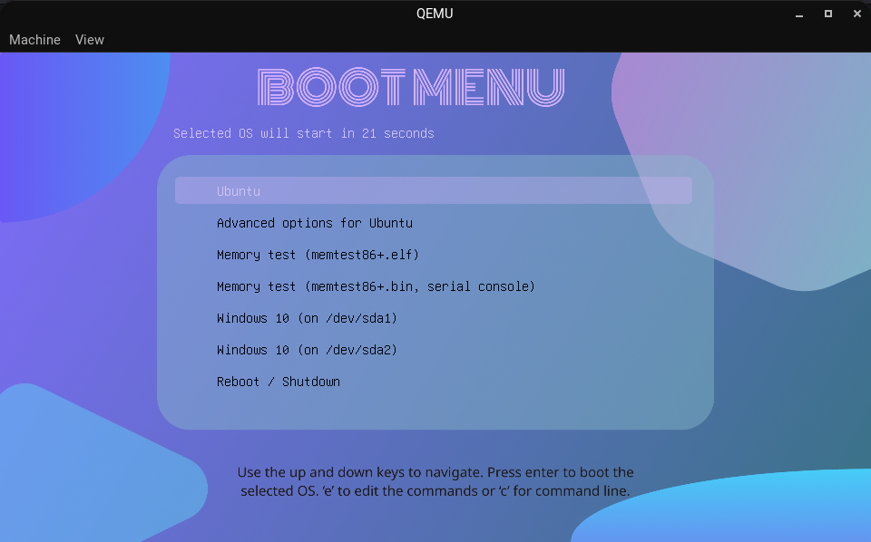

# NoiceGRUB - A simple GRUB2 theme


# Installation
### Using install.sh
```bash
chmod +x install.sh
sudo ./install.sh
```
### Manually
```bash
sudo -s
mkdir -p /boot/grub/themes
cp -r ./noicegrub /boot/grub/themes
echo "GRUB_THEME=/boot/grub/themes/noicegrub/theme.txt" >> /etc/default/grub
# Instead of echo >> , you can use nano texteditor and add the line "GRUB_THEME=/boot/grub/themes/noicegrub/theme.txt"
```
> Finally, update GRUB using the command `sudo update-grub`
