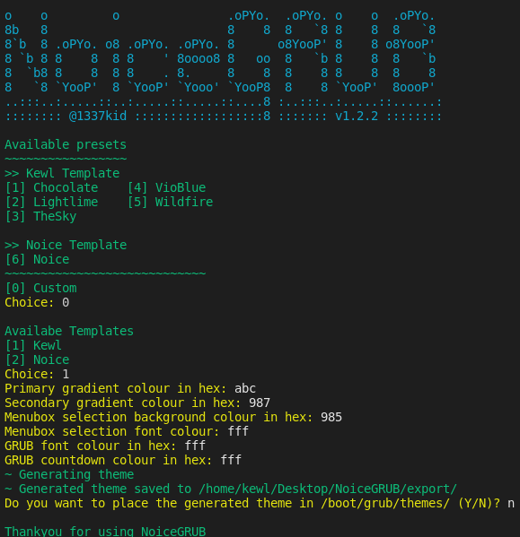
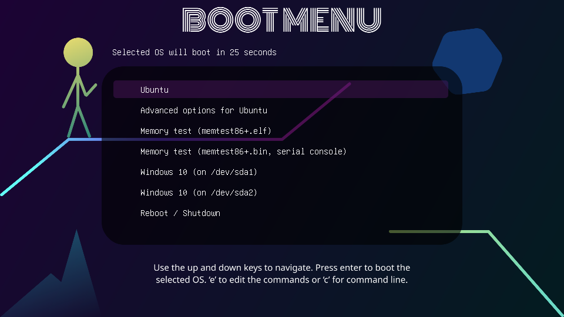
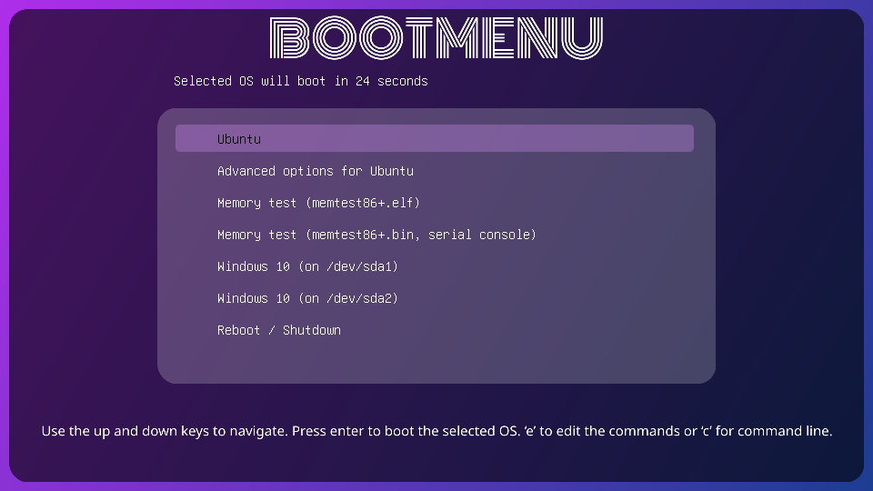
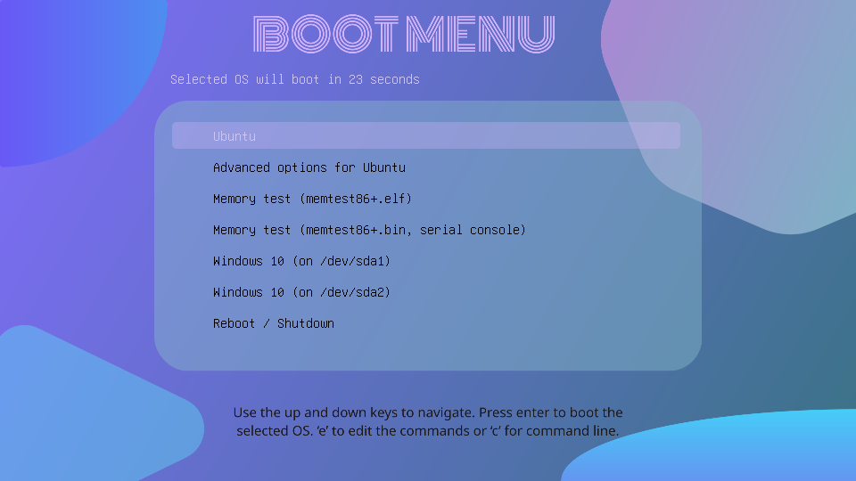
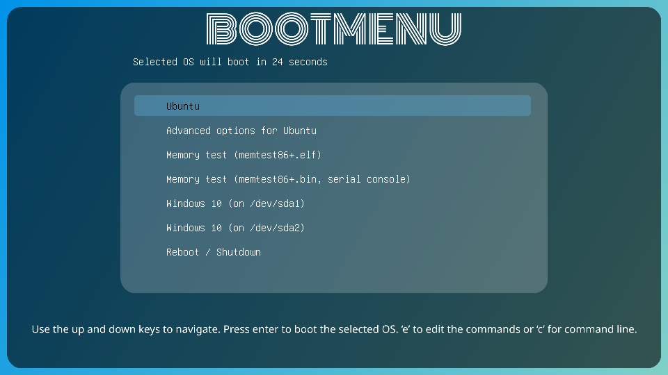
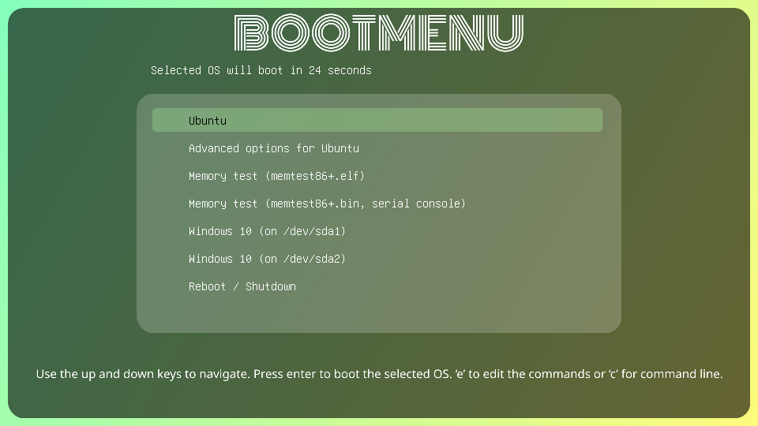
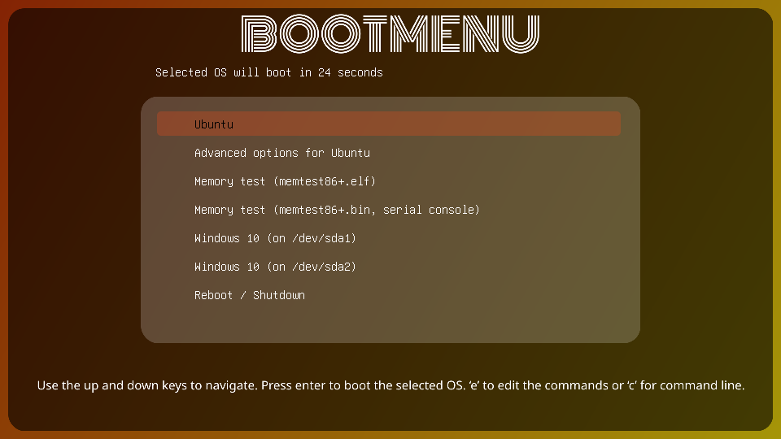

# NoiceGRUB
#### NoiceGRUB is a collection of linear gradient based GRUB2 themes that can be customised. By default NoiceGRUB comes with 3 templates and 6 presets.
# Contents
* [**Installation**][1]
* [**Presets**][2]
    * [**Create Your Own Preset**][3]
    * [**Preset Gallery**][4]


## [Installation][1]
```bash
git clone https://github.com/1337kid/NoiceGRUB.git
cd NoiceGRUB
pip3 install -r requirements.txt
python3 NoiceGRUB.py
```
## [Presets][2]
### [Create Your Own Preset][3]
NoiceGRUB preset files have the syntax of TOML and ends with `.toml` extension. Your own preset shall be placed in `presets` folder. It will be shown in the preset menu when you execute `NoiceGRUB.py`
#### File format
```toml
template='template name here'

# This section is mandatory and defines background.png file
[background]
primary="primary gradient colour"
secondary="secondary gradient colour"
header_font_colour = "header font colour or 'BOOTMENU' text colour"
footer_font_colour = "footer font colour or GRUB keymap text colour"
selection_bg_colour = "backgound colour of selection highlighter"

# This section defines theme.txt file and is mandatory too
[theme]
font_colour = "#000"
selection_font_colour = "#d0c4f5"
label_colour = "#d0c4f5"

# This section is optional and it depends on the template
[extra]
```
#### Noice template extra section
```toml
[extra]
menuboxbg=["menu box background colour"]
polygon=["primary gradeint colour of topright polygon","secondary gradient colour"]
ellipse=["primary gradeint colour of bottomright eliipse","secondary gradient colour"]
circle=["primary gradeint colour of topleft circle","secondary gradient colour"]
triangle=["background colour of bottom left triangle"]
```
#### TheMan template extra section
```toml
[extra]
centreleftlines=["centre-left lines, primary gradient colour","secondary gradient colour","tertiary gradient colour"]
bottomrightlines=["bottomright lines, primary gradient colour","secondary gradient colour"]
man=["primary gradient colour of the man","secondary gradient colour"]
polygon=["colour of bottomleft polygon"]
hexagon=["colour of topright hexagon"]
```

### [Preset Gallery][4]

| GradientGuy|VioBlue|
:-:|:-:
|  |  |

| Noice|TheSky|
:-:|:-:
|  |  |

| Lightlime|Wildfire|
:-:|:-:
|  |  |


[1]: #installation
[2]: #presets
[3]: #create-your-own-preset
[4]: #preset-gallery
