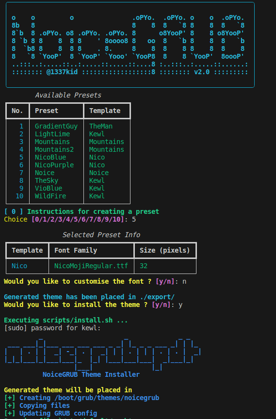

# NoiceGRUB
NoiceGRUB is a collection of linear gradient based GRUB2 themes that can be customisable. By default NoiceGRUB comes with 6 presets.

# Installation
```bash
git clone https://github.com/1337kid/NoiceGRUB.git
cd NoiceGRUB
pip3 install -r requirements.txt
python3 NoiceGRUB.py
```
# Presets
| Chocolate|Lightlime|
:-:|:-:
|  |  |

| Noice|TheSky|
:-:|:-:
|  |  |

| VioBlue|Wildfire|
:-:|:-:
|  |  |
